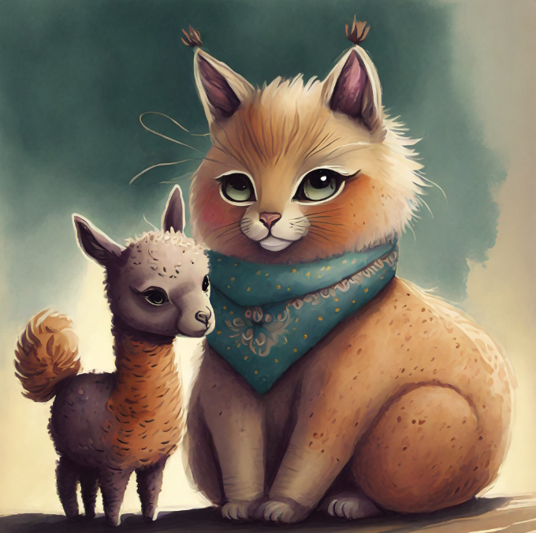

# Cat Puppy
The cat has a puppy that sometimes answers for him... but it's a baby llama

  

  

## Settings

- **base_url**: url to call ollama
- **use_by_default**:  if set to true you want to automatically manage the engagement of the puppy model, if set to false the engagement of the puppy model is managed by external plugins via hooks
- **use_for_start_tools**: if set to true you want to use the puppy model also to call the tools (not a recommended option given that the local model typically has greater difficulty in correctly undertaking these actions)
- **sentence_max_length**: maximum number of words in a sentence to use the puppy model, beyond which the main model must be recalled
- **puppy_prompt**: this is the prompt attributed to the puppy model

## Usage by external plugins 

<pre><code>
'''
This hook is used to acquire the puppy model 
from an external plugin
'''
@hook()
def set_cat_puppy(puppy, cat):
    puppy
</code></pre>

<pre><code>
'''
This hook is used to decide, by an external plugin, 
when to involve the puppy model
'''
@hook()
def use_cat_puppy(puppy, cat):
    return False
</code></pre>